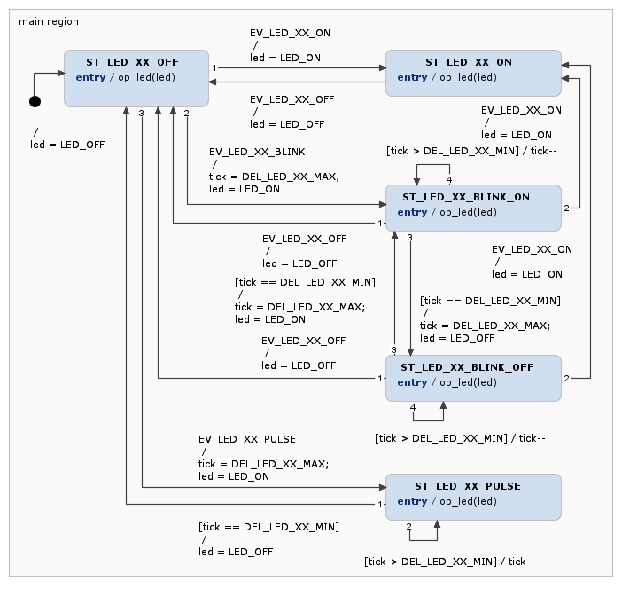
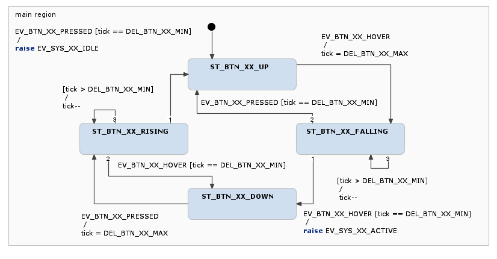
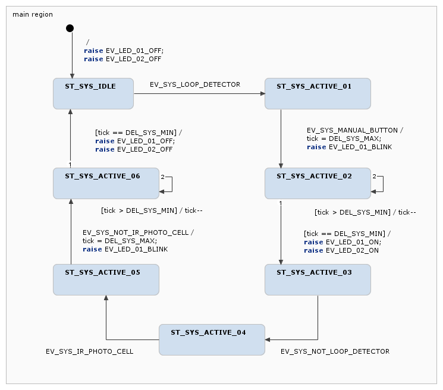

# Taller de Sistemas Embebidos

En este proyecto se implementa una aplicación para la placa STM32
[Nucleo-F103RB](https://www.st.com/en/evaluation-tools/nucleo-f103rb.html). Esta
aplicación es de tipo no bloqueante y [dirigida por
eventos](https://es.wikipedia.org/wiki/Programaci%C3%B3n_dirigida_por_eventos),
ademas se actualiza en cada milisegundo. A su vez esta aplicación incluye 3
tareas `task_sensor`, `task_system` y `task_actuator` las cuales se modelan
mediante maquinas de estado. De estas 3 tareas en esta instancia solo se ha
implementado la maquina de estados de la primera `task_sensor`, de las restantes
solo se ha implementado lo suficiente como para que la aplicación se ejecute sin
errores.

## Estructura del proyecto

Para el proyecto se utiliza la IDE de STM:
[STM32CubeIDE](https://www.st.com/en/development-tools/stm32cubeide.html). Una
vista de árbol nivel 3 (desde la raíz del directorio) se muestra a continuación.

```console
.
|-- app
|   |-- inc
|   |   |-- app.h
|   |   |-- board.h
|   |   |-- dwt.h
|   |   |-- logger.h
|   |   |-- systick.h
|   |   |-- task_actuator_attribute.h
|   |   |-- task_actuator.h
|   |   |-- task_actuator_interface.h
|   |   |-- task_sensor_attribute.h
|   |   |-- task_sensor.h
|   |   |-- task_system_attribute.h
|   |   |-- task_system.h
|   |   `-- task_system_interface.h
|   |-- src
|   |   |-- app.c
|   |   |-- logger.c
|   |   |-- systick.c
|   |   |-- task_actuator.c
|   |   |-- task_actuator_interface.c
|   |   |-- task_sensor.c
|   |   |-- task_system.c
|   |   `-- task_system_interface.c
|   |-- app.txt
|   |-- readme.txt
|   |-- task_actuator.png
|   |-- task_actuator.txt
|   |-- task_sensor.png
|   |-- task_sensor.txt
|   |-- task_system.png
|   `-- task_system.txt
|-- Core
|   |-- Inc
|   |   |-- main.h
|   |   |-- stm32f1xx_hal_conf.h
|   |   `-- stm32f1xx_it.h
|   |-- Src
|   |   |-- main.c
|   |   |-- stm32f1xx_hal_msp.c
|   |   |-- stm32f1xx_it.c
|   |   |-- syscalls.c
|   |   |-- sysmem.c
|   |   `-- system_stm32f1xx.c
|   `-- Startup
|       `-- startup_stm32f103rbtx.s
|-- Drivers
|   |-- CMSIS
|   |   |-- Device
|   |   |-- Include
|   |   `-- LICENSE.txt
|   `-- STM32F1xx_HAL_Driver
|       |-- Inc
|       |-- Src
|       `-- LICENSE.txt
|-- README.md
|-- STM32F103RBTX_FLASH.ld
`-- tdse-tp2_01-model_integration.ioc

15 directories, 44 files
```

### Archivo `Core/Startup/startup_stm32f103rbtx.s`

Este archivo está escrito en arm assembly y se ejecuta al inicializar el
microcontrolador, el propósito es inicializar los registros principales (como el
stack pointer o el program counter) la memoria y periféricos, para finalmente
transferir el control a la aplicación principal, cuyo punto de entrada es la
función `main` (definida en el archivo `Core/Src/main.c`) esto se puede ver en
la linea 100 del archivo de inicialización, en la cual se ejecuta una
instrucción `bl` (branch with link) y luego el símbolo `main`. El único tipo de
dato utilizado es `word` que representa una variable de 4 bytes (o 32 bits).

### Archivo `Core/Src/main.c`

El archivo `main.c` es un archivo escrito en C que contiene el punto de entrada
del programa principal, este punto de entrada es invocado al momento de
inicializar el microcontrolador, como se mencionó previamente. El patrón de
diseño de este archivo es procedural, ya que la ejecución del programa se lleva
a cabo mediante la invocación de diferentes funciones o subrutinas.

Los métodos que se encuentran en este archivo además de la (función principal
`main`) son: `initialise_monitor_handles`, `HAL_Init`, `SystemClock_Config`,
`MX_GPIO_Init`, `MX_USART2_UART_Init`, `app_init`, `app_update` y
`Error_Handler`.

La función o método `initialise_monitor_handles` se encarga de inicializar o
configurar como se manipula la entrada y salida, por ejemplo con `printf` al
momento de depurar el código, en particular se utiliza el protocolo UART para
comunicarse con la computadora, es por esto que se inicializa con la función
`MX_USART2_UART_Init`.

La función `SystemClock_Config` como se indica en el nombre configura los
relojes internos del microprocesador, como ser las fuentes y los pre-escaladores
de los buses y los timers. La velocidad del microprocesador se almacena en la
variable global `SystemCoreClock`, esta variable se debe actualizar si se cambia
la velocidad del microprocesador.

Cuando se ejecuta la función `HAL_Init` se inicializa los estados internos de la
librería HAL (Hardware Abstraction Layer) lo que incluye el timer `SysTick`,
cuyo estado se almacena en la estructura global del mismo nombre. `SysTick` se
utiliza para generar una interrupción por cada milisegundo, para esto cuenta
desde `SystemCoreClock/1000` hasta 0, por ejemplo, para una frecuencia de 64MHz,
el el timer cuenta desde 64000 hasta 0, lo que produce una interrupción exacta
por milisegundo.

La función `Error_Handler` se ejecuta en caso de error pero no tiene una
funcionalidad definida. Por ultimo en la función `main` se inicializa la
aplicación con `app_init` y en cada ciclo se actualiza el estado de la
aplicación con `app_update`.

### Archivo `app/src/app.c`

En este archivo se definen las funciones `app_init` y `app_update` que se
invocan en la función `main`, y se define el callback `HAL_SYSTICK_Callback`,
este ultimo es una función que previamente ya estaba definida pero de manera
débil en la librería HAL, y se inicializa al momento de invocar `HAL_Init`, esta
función se ejecuta cada 1 milisegundo debido a una interrupción generada por un
timer. El callback se define de manera tal de incrementar el contador global de
ticks de la aplicación `g_app_tick_cnt` y el interno de cada tarea
`g_task_*_tick_cnt`, de esta manera, cada vez que el contador de cada tarea y de
la aplicación dejan de ser nulos (en cada milisegundo) la aplicación y las
tareas se deben actualizar.

Cada vez que se ejecutan las tareas se mide el tiempo de ejecución contando los
microsegundos que se tarde en ejecutar esa tarea, el peor de los tiempos de
ejecución se guarda en el dato `WCET` de cada tarea. La aplicación también lleva
un registro del tiempo de ejecución en microsegundos que se tarda en ejecutar
todas las tareas, y resulta de la suma del tiempo de ejecución cada tarea, el
resultado se guarda en la variable global `g_app_runtime_us`, esta variable se
actualiza en cada ejecución de las tareas, ademas se ha agregado la variable
`g_app_WCET_us` en la cual se guarda el peor tiempo de ejecución de todas las
tareas desde que se inicio el microcontrolador.

Analizando la evolución de la variable `g_app_WCET_us` se ha detectado el
impacto de imprimir texto en la consola con `LOGGER_INFO` en el tiempo de
ejecución de la aplicación, así como analizando el dato `WCET` de cada tarea.
Sin impresión el tiempo aproximado de ejecución de una tarea es menor a 10 us,
mientras que utilizando `LOGGER_INFO` el tiempo se incrementa 95 ms
aproximadamente, esto hace que el peor tiempo de ejecución de la aplicación se
incremente de 13 us a 106 us.

### Archivo `app/src/task_sensor.c`

En este archivo se implementa las funciones del modelo sensor, el cual se
modela, en esta instancia como un botón, utilizando una maquina de estados.

### Archivo `app/src/task_sensor_attribute.h`

### Archivo `app/task_sensor.png`

## Diagrama de estados de tareas

Como se mencionó previamente, las tareas se modelan mediante maquinas de
estados, a continuación se muestras los diagramas respectivos.






